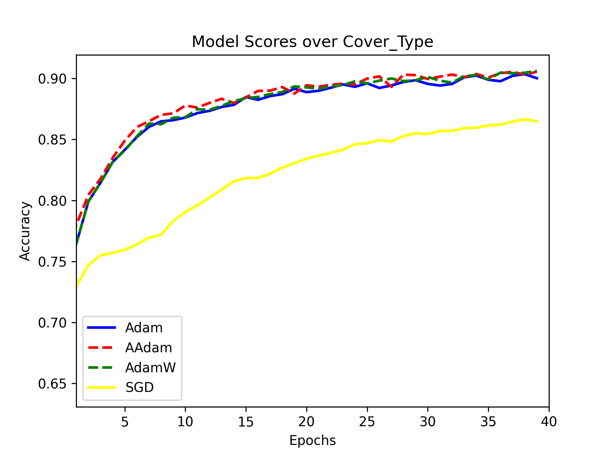
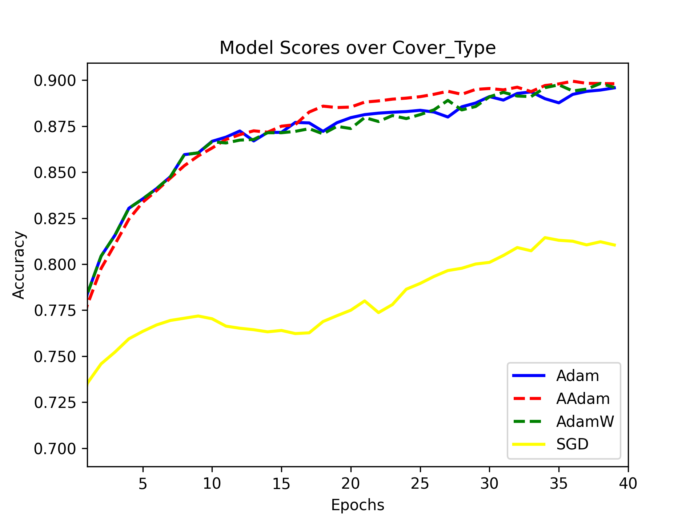
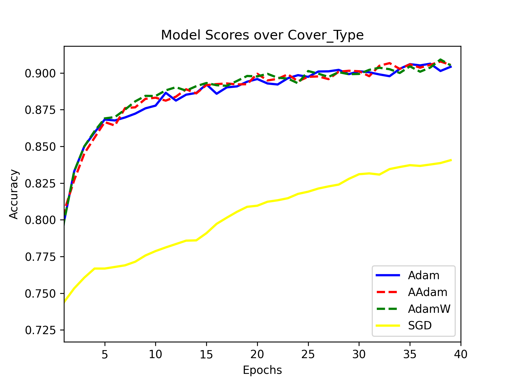
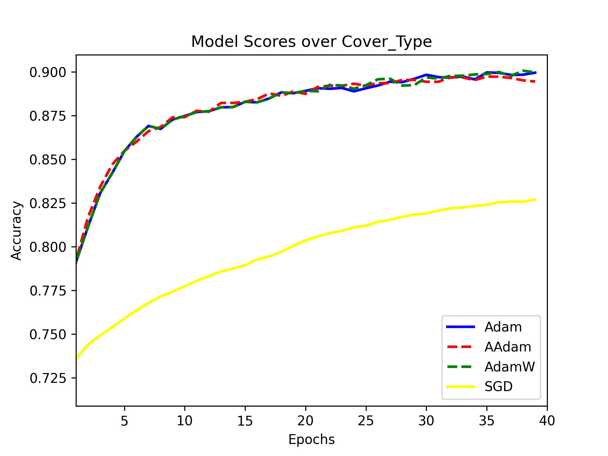
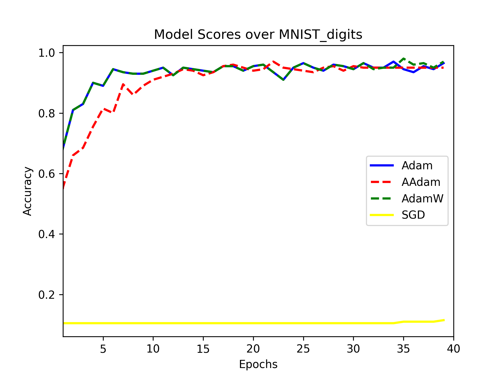
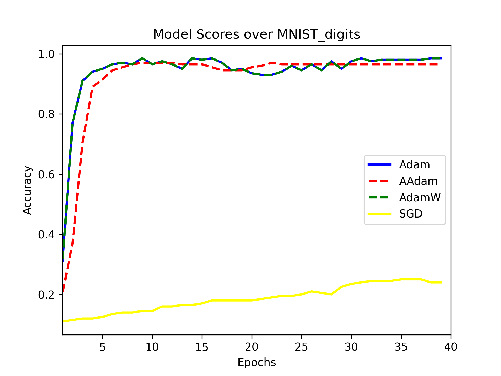
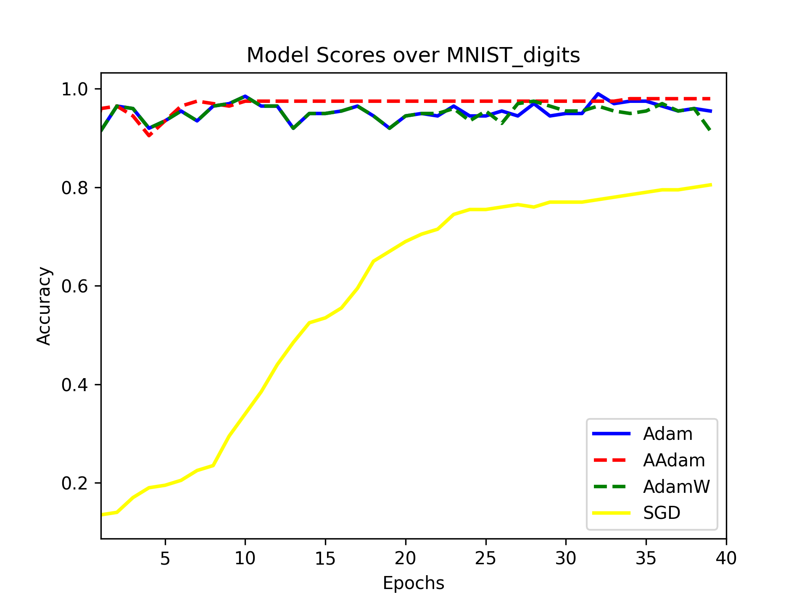
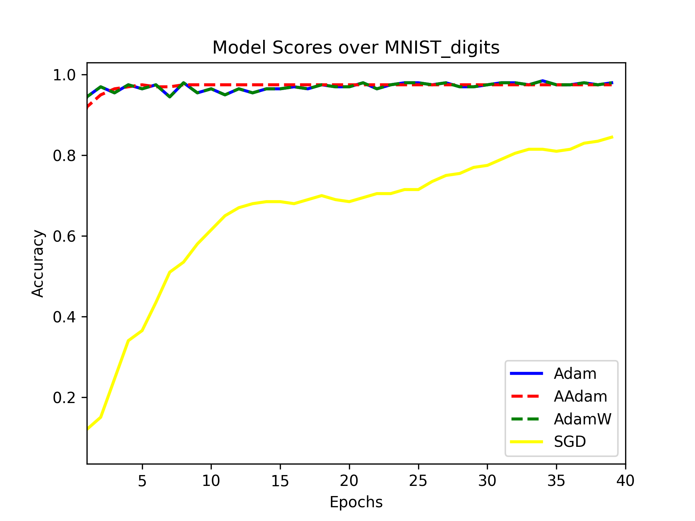

# Adam Optimizer Improvements for deep neural networks using sklearn - Workshop

_For [How to run](#how-to-run) instructions click or scroll down_

## Abstract
Adam is a great Optimizer (often called solver), 
introduced in 2014 - [Adam: A method for
stochastic optimization](https://arxiv.org/abs/1412.6980) and **among the most popular optimizers**.

It converges faster than SGD, And yet achieve good results. 
It does so by combing the advantages of two other optimization algorithms, namely, RMSProp and AdaGrad. 
The result is quite fast optimizer which produce relatively good results, 
especially in the deep learning field, and hence the popularity. 
Note that some claim that with enough training time SGD with Momentum might be able to 
outperform Adam in accuracy.

As mentioned, Adam original article has been published in 2014, 
since then a few improvements has been published.

In this workshop we implemented two of them:
1. [AAdam](https://openreview.net/pdf?id=HJfpZq1DM)
2. [AdamW](https://arxiv.org/pdf/1711.05101v3.pdf) - very popular in the field of deep neural networks for NLP

Then we conducted per epoch accuracy test comparison and plotted the results.

Our results support the claims that the "improved" versions of Adam 
indeed preform better (with almost no exceptions) in real life scenarios.
Both in terms of accuracy (a slight improvement, especially in deeper networks) 
and in terms training time - less time is required to achieve converges with roughly same accuracy.

Therefore, we suggest using them.
## Experiment Goal
We wanted to explore better ways to optimize neural networks.
As of today data scientists, especially less involved in the Machine Learning field
tend to use sklearn package as a blackbox tool for their prediction tasks.
Because of sklearn's massive popularity solutions that are not built-in sklearn are often overlooked,
and left for the "Pros" which tend to use Pytorch, Tensorflow or Keras.
We wanted to explore some up-to-date Optimizers to optimize neural networks without losing the "ease of use"
of sklearn. 
Moreover, **we seek to set some thumb rules as to when and how to use those new optimizers.**

The process of stating those rules, in itself is some sort of optimization challenge, 
that we approached in less methodical way but with trial and error (which is often the case in Machine Learning).

## What are Optimizers?
In machine learning, optimizers are algorithms or methods used to update the parameters of a machine learning model to minimize the loss function during training. The loss function measures how well the model's predictions match the actual target values, and the goal of optimization is to find the values of the model's parameters that result in the lowest possible loss.

Optimizers work by adjusting the weights and biases of the model in response to the gradients of the loss function with respect to these parameters. The gradients indicate the direction of steepest ascent of the loss function, and the optimizer takes steps in the opposite direction to descend the loss surface.

There are many different types of optimizers used in machine learning, each with its own strengths and weaknesses. Some popular optimizers include Stochastic Gradient Descent (SGD), Adam, RMSProp, Adagrad, and Adadelta. Each optimizer has different hyperparameters and update rules, and choosing the right optimizer can have a significant impact on the performance of a machine learning model.

## Experience Setup
Experience setup is as following:
### Optimizers:
We compared 4 different optimizers
1. Adam - built-in sklearn
2. AAdam - Implemented manually
3. AdamW - Implemented manually
4. SGD - built-in sklearn
### Datasets:
We used 2 different datasets:
1. MNIST Digits (Limited to only 1000 samples, and 200 more for test)
2. Cover Type (Limited to 100,000 samples and 20,000 more for test)

The limits are to manage training time, 
emphasise learning curve,
and testing behavior of our optimizers across different type of tasks.
*Limiting MNIST digits is mandatory, otherwise one epoch over the entire data is enough for over 95% accuracy.
### Train-Test
We iterated 40 epochs - testing the accuracy after each epoch, eventually we plotted the results to a graph.
We used the recommended hyper-parameters from the papers and fixed the rest of parameters between the models.
We also disabled any randomization related parameters to keep the tests as "fair" as possible.

## Implementation
1. AAdam and AdamW implementations are found in 
`custom_aadam.py`, `custom_adamW.py` respectively.
2. Modified `_multilayer_perceptron.py` file, 
which is built-in sklearn file edited by us to add support for the new optimizers
can be found at `custom-sklearn/sklearn/neural_network/_multilayer_perceptron.py`
3. A `test.py` to reproduce the results, or alternatively, testing over different datasets.
4. `/datasets_results_plots` folder with all the plots and `/logs` folder can be found at project root.

# Results
We tested the algorithms on two data sets:
- Cover Type
    - epochs - 40
    - train size - 100K

| Layers  | 
| ---  |
| Layers = 9  |
| 
| Layers = 6  |
| 
| Layers = 5 (With a lot of neurons per layer) |
|   |
| Layers = 3  |
|   |

- MNIST
    - epochs - 40
    - train size - 1K

| Layers  | 
| ---  |
| Layers = 9  |
| 
| Layers = 6  |
| 
| Layers = 5 (With a lot of neurons per layer) |
|   |
| Layers = 3  |
|   |

# Conclusions

We can see the choice of the best optimizer will influenced mostly by the depth of the model (number of layers).
For example, Adam optimizer may work well for shallow models with fewer layers, while AdamW and AAdam optimizers may be better suited for deeper models with more layers.

In those experiments Adam optimizer performed better:
- MNIST digits: 
    - Layers = 3
- Cover Type
    - Layers = 3
    - Layers = 5

In those experiments AdamW and AAdam performed better:
- Cover Type
    - Layers = 6
    - Layers = 9
    - Layers = 5
   
This is because deeper models often have a larger number of parameters, which can make it more difficult for the optimizer to converge and avoid overfitting. Regularization techniques like weight decay (used in AdamW) and accumulated gradients (used in AAdam) can help address these issues, and may be more effective for deep models.
Therefore, if you have a deep neural network, it may be a good idea to consider using AdamW or AAdam optimizer instead of Adam optimizer. However, it is important to experiment with different optimizers and hyperparameters to find the best fit for your specific model and dataset.

Few more conclusions we conclude from the graphs above:
- When the training time is longer the AdamW has highest score between the others optimizers
- AAdam for MNIST data set converge fastest - we can assume that it's suitable with small data sets and short training time. It doesn't supply the best results for long runs.
  Although, under 20 epochs it's has the best results
- AdamW suits best with deep and wide nets
- AAdam suits best for small data sets and short training time

# Bibliography
[Adam: A method for stochastic optimization](https://arxiv.org/abs/1412.6980)

[AAdam: IMPROVING ADAM OPTIMIZER](https://openreview.net/pdf?id=HJfpZq1DM)

[AdamW: DECOUPLED WEIGHT DECAY REGULARIZATION](https://arxiv.org/pdf/1711.05101v3.pdf)

##How to run
Microsoft Windows users should first set `git config core.protectNTFS false` in order to clone.

1. `pip install -r requirements.txt`
2. `cd custom-sklearn/`
3. `python setup.py install` - it should take a while, building a package from source.

The code from `test.py` is now runnable.
*The project has been tested on Mac OSX with Python 3.8

**Explanation:**

custom-sklearn is scikit-learn==1.2.1 with custom `_multilayer_perceptron.py`
file to support additional solvers, our `custom_aadam`, `custom_adamW` etc.
Note that each time you edit `custom-sklearn/sklearn/neural_network/_multilayer_perceptron.py`
you have to build the package again in order to changes take place.
